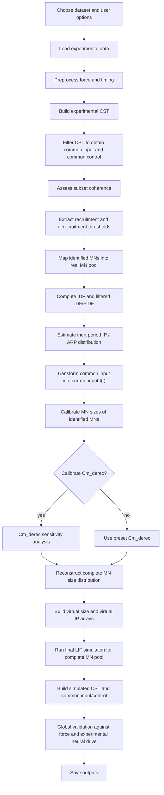
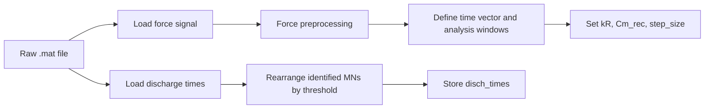
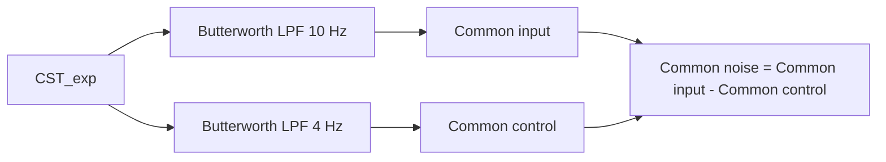
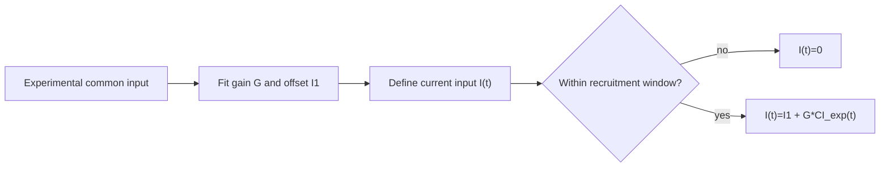
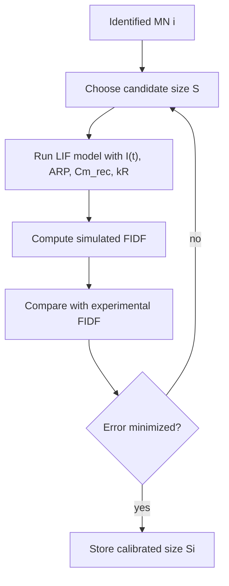
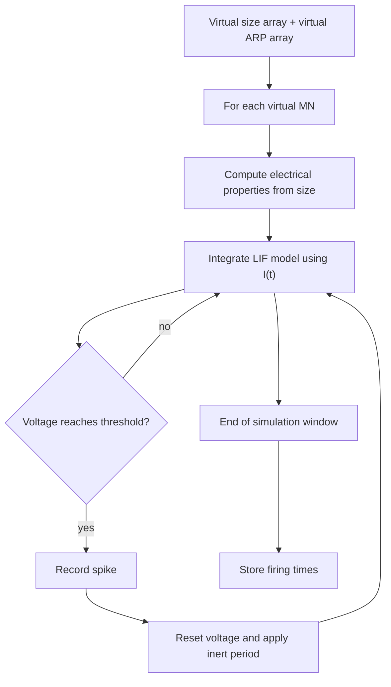
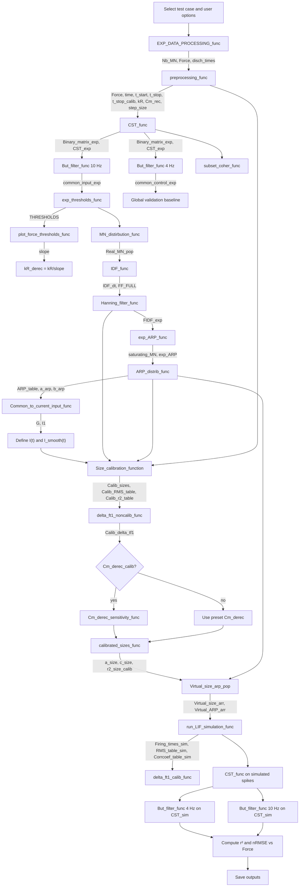

# Detailed Flowchart for `1_MAIN_MN_model.py`

This document explains the **entire algorithmic workflow** of the first entry script,
`1_MAIN_MN_model.py`, in a **step-by-step** manner.

It is meant to complement the earlier mathematical walkthrough by adding the
**hidden submodels and processing steps** that are present in the code but are not always
made explicit in the shorter description.

---

## 1. High-level purpose of the script

The script reconstructs the firing behavior of a **complete motoneuron (MN) pool** from:

- experimental decomposed HDEMG spike trains,
- an experimental force trace,
- literature-based physiological constraints,
- and a leaky integrate-and-fire (LIF) motoneuron model.

The workflow is:

1. Load experimental force and discharge times.
2. Build experimental neural-drive descriptors (CST, common input/control).
3. Locate the identified experimental MNs in a full recruitment-ranked MN pool.
4. Estimate experimental firing-frequency trajectories and inert periods (IP/ARP).
5. Convert experimental common input into a current input function `I(t)`.
6. Calibrate the electrophysiological size `S` of each identified MN.
7. Fit a size distribution and IP distribution for the complete virtual MN pool.
8. Simulate the firing behavior of the complete virtual pool using the LIF model.
9. Compare simulated neural drive against experimental neural drive and force.
10. Save outputs.

---

## 2. Full algorithm flowchart (high level)

---

## 3. Data and user options

### 3.1 User-controlled options

The script begins by selecting:

- **dataset**: `TA_35_D`, `TA_35_H`, `TA_50`, or `GM_30`
- **whether `Cm_derec` is calibrated**
- **whether resistance `kR` is adapted during derecruitment**
- **whether figures are plotted**
- **whether outputs are saved**

### 3.2 Dataset metadata table

For each dataset, the script stores:

- `author`
- `muscle`
- `plateau_time1`, `plateau_time2`
- `end_force`
- `MVC`
- `MN_pop`
- `fs`

This metadata is later used to:

- define the contraction plateau,
- compute thresholds in `%MVC`,
- define the analysis window,
- and set the sampling rate.

---

## 4. Step 1.1 — Load and preprocess experimental data

### 4.1 Module calls

- `EXP_DATA_PROCESSING_MOD.EXP_DATA_PROCESSING_func`
- `Reshaping_MOD.preprocessing_func`

### 4.2 What this step does

1. Load the raw force signal and spike trains from the `.mat` file.
2. Sort discharge times from lower-threshold to higher-threshold identified MNs.
3. Preprocess the force trace.
4. Build the time vector.
5. Set key simulation parameters:
   - `t_start`
   - `t_stop`
   - `t_stop_calib`
   - `kR`
   - `Cm_rec`
   - `step_size`

### 4.3 Inputs and outputs

**Inputs**

- raw dataset `.mat`
- dataset metadata (`author`, `end_force`, `fs`, plateau times)

**Outputs**

- `Nb_MN`: number of experimentally identified MNs
- `Force`: processed force/reference trace
- `disch_times`: object array of discharge times
- `time`: time vector
- `MN_list`: identified MN labels
- `t_start`, `t_stop`, `t_stop_calib`
- `kR`, `Cm_rec`, `step_size`

### 4.4 Flowchart

---

## 5. Step 1.2a — Build the cumulative spike train (CST)

### 5.1 Module call

- `CST_MOD.CST_func`

### 5.2 Hidden model

Each identified MN spike train is converted to a binary spike train:

\[
sp_i[n] =
\begin{cases}
1, & \text{if MN } i \text{ fires at sample } n \\
0, & \text{otherwise}
\end{cases}
\]

Then the experimental cumulative spike train is:

\[
CST_{exp}[n] = \sum_{i=1}^{N_b} sp_i[n]
\]

where `N_b = Nb_MN` is the number of identified MNs.

### 5.3 Outputs

- `Binary_matrix_exp`
- `CST_exp`

### 5.4 Meaning

`CST_exp` is the summed identified neural activity at each time sample.

---

## 6. Step 1.2b — Common input, common control, common noise

### 6.1 Module call

- `But_filter_MOD.But_filter_func`

### 6.2 Hidden model

The CST is low-pass filtered to estimate the common drive components:

- **common input**: Butterworth low-pass at 10 Hz
- **common control**: Butterworth low-pass at 4 Hz

\[
CI_{exp}(t) = LPF_{10Hz}(CST_{exp})
\]

\[
CC_{exp}(t) = LPF_{4Hz}(CST_{exp})
\]

The code also defines common noise as:

\[
Noise_{exp}(t) = CI_{exp}(t) - CC_{exp}(t)
\]

### 6.3 Why two filters?

- `CI_exp`: broader common synaptic input estimate
- `CC_exp`: lower-frequency force-related component

### 6.4 Flowchart

---

## 7. Step 1.2c — Coherence between subsets of MNs

### 7.1 Module call

- `subset_coher_MOD.subset_coher_func`

### 7.2 Hidden model

The identified MN pool is repeatedly split into two subsets.
For each split:

1. Build subset CSTs.
2. Filter them.
3. Compute coherence / similarity.
4. Average over repeated random splits.

### 7.3 Meaning

This checks whether the identified subset of MNs is large and consistent enough to estimate a meaningful common input.

### 7.4 Output

- `avg_all_coher`

---

## 8. Step 1.3a — Recruitment and derecruitment thresholds

### 8.1 Module call

- `EXP_THRESHOLDS_MOD.exp_thresholds_func`

### 8.2 Hidden model

For each identified MN `i`:

- first discharge sample: `s_i^first`
- last discharge sample: `s_i^last`

Convert to time:

\[
t_i^{rec} = s_i^{first}/f_s
\]

\[
t_i^{derec} = s_i^{last}/f_s
\]

Extract common-input thresholds:

\[
CI_i^{rec} = CI_{exp}(s_i^{first})
\]

\[
CI_i^{derec} = CI_{exp}(s_i^{last})
\]

Extract force thresholds in `%MVC`:

\[
F_i^{rec} = \frac{Force[s_i^{first}]}{\max(Force)} \times MVC \times 100
\]

\[
F_i^{derec} = \frac{Force[s_i^{last}]}{\max(Force)} \times MVC \times 100
\]

### 8.3 Output matrix

`THRESHOLDS` stores for each MN:

1. recruitment time
2. recruitment common-input threshold
3. recruitment force threshold (%MVC)
4. derecruitment time
5. derecruitment common-input threshold
6. derecruitment force threshold (%MVC)

### 8.4 Additional fit

The script fits a relation between force derecruitment and recruitment thresholds.
This fit is later used to adapt MN resistance during derecruitment:

\[
kR_{derec} = \frac{kR}{slope_{force\ threshold\ fit}}
\]

---

## 9. Step 1.3b — Map identified MNs into the real MN population

### 9.1 Module call

- `MN_distirbution_MOD.MN_distirbution_func`

### 9.2 Hidden model

Only a subset of MNs is experimentally identified.
The code maps each identified MN into a complete recruitment-ranked MN pool using:

- the experimental force recruitment threshold,
- and a muscle-specific recruitment-threshold distribution from the literature.

So each identified MN gets a **population location** `j`.

### 9.3 Meaning

This creates:

- a sparse set of experimental anchor points in the full MN pool,
- which are later used to fit size and inert-period distributions.

### 9.4 Output

- `Real_MN_pop`

---

## 10. Step 1.4 — Experimental IDF and filtered IDF (FIDF)

### 10.1 Module calls

- `IDF_MOD.IDF_func`
- `Hanning_filter_MOD.Hanning_filter_func`

### 10.2 Hidden model

For each MN, compute inter-spike intervals:

\[
ISI_k = t_{k+1} - t_k
\]

Then instantaneous discharge frequency (IDF):

\[
IDF_k = \frac{1}{ISI_k}
\]

Because raw IDF is noisy, a moving Hanning window is applied:

\[
FIDF_{exp}(t) = HanningSmooth(IDF(t))
\]

### 10.3 Outputs

- `IDF_dt`
- `FF_FULL`
- `FIDF_exp`

### 10.4 Role

`FIDF_exp` is the main firing-rate target used later for MN size calibration.

---

## 11. Step 1.5 — Estimate inert period (IP / ARP)

### 11.1 Module calls

- `exp_ARP_MOD.exp_ARP_func`
- `ARP_distrib_MOD.ARP_distrib_func`

### 11.2 Hidden model

For certain “saturating” MNs, the code estimates the inert period (also called ARP) from the firing-rate plateau behavior.

The inert period is a phenomenological minimum inter-spike interval that constrains maximum firing rate:

\[
FR_{max} \approx \frac{1}{IP}
\]

The code:

1. identifies saturating MNs,
2. estimates their experimental IPs,
3. fits an IP trendline across the population,
4. predicts IPs for the rest of the virtual MN pool.

### 11.3 Outputs

- `saturating_MN`
- `exp_ARP`
- `a_arp`, `b_arp`
- `ARP_table`
- `Non_saturating_MN`

### 11.4 Meaning

`ARP_table` provides the inert period for the identified MNs and later supports creation of `Virtual_ARP_arr` for the complete pool.

---

## 12. Step 2 — Transform common input into current input `I(t)`

### 12.1 Module call

- `Curr_input_MOD.Common_to_current_input_func`

### 12.2 Hidden model

The common input signal is not directly used by the LIF model.
It is transformed into a current input:

\[
I(t) = I_1 + G\,CI_{exp}(t)
\]

inside the active recruitment/derecruitment interval.
Outside that interval:

\[
I(t) = 0
\]

where:

- `G` = gain,
- `I1` = baseline current offset.

The gain is constrained using literature-based rheobase distributions.

### 12.3 Outputs

- `G`
- `I1`
- function `I(t)`
- optional smoothed version `I_smooth(t)` based on common control

### 12.4 Flowchart

---

## 13. Step 3 — Calibrate identified MN sizes

### 13.1 Module call

- `Simplified_Size_calibration_MOD.Size_calibration_function`

### 13.2 Hidden model

This is a key inverse problem.
For each identified MN, the code adjusts the MN size `S` so that the **simulated** FIDF matches the **experimental** FIDF.

The optimization is constrained by physiological size limits:

- `Size_min`
- `Size_max`

The simulation for a candidate size uses the LIF model together with:

- `I(t)`
- `Cm_rec`
- `kR`
- `ARP_table`
- time-stepping via `step_size`

### 13.3 Objective

For each identified MN, choose size `S_i` that minimizes the error between:

\[
FIDF_{sim,i}(t; S_i)
\]

and

\[
FIDF_{exp,i}(t)
\]

### 13.4 Outputs

- `Calib_sizes`
- `Calib_RMS_table`
- `Calib_r2_table`
- `Calib_delta_tf1`

### 13.5 Flowchart

---

## 14. Step 3a — Optional `Cm_derec` sensitivity analysis

### 14.1 Module call

- `Cm_derec_sensitivity_MOD.Cm_derec_sensitivity_func`

### 14.2 Hidden model

The model optionally tests several values of the **specific membrane capacitance during derecruitment**:

- keep calibrated sizes fixed,
- rerun LIF simulations,
- compute average performance,
- select the `Cm_derec` giving the best fit.

### 14.3 Output

- selected `Cm_derec`
- sensitivity curves for RMS / `r^2`

If this option is disabled, the code uses the preset `Cm_derec`.

---

## 15. Step 4 — Reconstruct the complete size distribution

### 15.1 Module call

- `calibrated_sizes_MOD.calibrated_sizes_func`

### 15.2 Hidden model

The calibrated sizes of the identified MNs are only sparse anchor points.
The code fits a parametric size law across the whole MN population.

In the script, the size distribution is represented as:

\[
S(j) = a\,2.4^{\left(\frac{j+1}{N}\right)^c}
\]

where:

- `j` = location in the real MN population,
- `N = true_MN_pop`,
- `a`, `c` = fitted parameters.

### 15.3 Outputs

- updated `Real_MN_pop`
- fitted size parameters `a_size`, `c_size`
- `r2_size_calib`

### 15.4 Meaning

This produces a smooth size distribution for the complete virtual MN pool.

---

## 16. Step 5 — Simulate the firing activity of the complete MN pool

### 16.1 Module calls

- `Virtual_pop_size_arp_MOD.Virtual_size_arp_pop`
- `run_LIF_simulation_MOD.run_LIF_simulation_func`

### 16.2 Hidden model

First build the complete virtual arrays:

- `Virtual_size_arr`
- `Virtual_ARP_arr`

Then simulate every virtual MN using the LIF model.

### 16.3 The LIF MN submodel

For each virtual MN:

1. Use size `S` to determine electrical properties.
2. Use `I(t)` as the input current.
3. Integrate the leaky integrate-and-fire dynamics.
4. When the membrane voltage reaches threshold, generate a spike.
5. Reset voltage.
6. Enforce the inert period `IP`.
7. Continue through the simulation window.

A simplified model equation is:

\[
C \frac{dV}{dt} = -\frac{V}{R} + I(t)
\]

with fire-and-reset logic and an inert period.

### 16.4 Outputs

- `nME_sim`
- `RMS_table_sim`
- `Corrcoef_table_sim`
- `Firing_times_sim`
- `delta_tf1_end`

### 16.5 Flowchart

---

## 17. Step 6 — Global validation

### 17.1 Rebuild simulated CST and common drive

Using the simulated firing times, the code rebuilds:

- `Binary_matrix_sim`
- `CST_sim`
- `common_control_sim`
- `common_input_sim`

with the same CST and Butterworth-filter pipeline used for the experimental data.

### 17.2 Validation comparisons

The code compares:

1. experimental common control vs force,
2. simulated common control vs force.

Metrics:

- coefficient of determination `r^2`
- normalized RMSE `nRMSE`

### 17.3 Metrics

\[
r^2 = corr(x,y)^2
\]

\[
nRMSE = RMS\left(\frac{x}{\max x}, \frac{y}{\max y}\right)\times 100
\]

### 17.4 Meaning

This asks whether the reconstructed complete virtual MN pool produces a neural-drive signal whose low-frequency component matches the force trace as well as or better than the experimental subset-derived signal.

---

## 18. Step 7 — Save outputs

If saving is enabled, the script stores:

- cropped time array
- force trace
- experimental discharge times
- predicted discharge times
- parameters
- main results
- calibration onset error
- calibration nRMSE
- calibration `r^2`
- calibration FIDF results

These files are later consumed by the validation and stored-results plotting scripts.

---

## 19. Full detailed flowchart with modules and major variables

---

## 20. Conceptual summary of the hidden models

Below is a compact “what each hidden submodel means” summary.

| Submodel / Module | Purpose | Main idea |
|---|---|---|
| `CST_MOD` | Sum identified spike trains | build experimental neural-drive proxy |
| `But_filter_MOD` | Extract common input/control | low-pass filtered CST |
| `subset_coher_MOD` | Check representativeness of identified MN subset | split-half coherence |
| `EXP_THRESHOLDS_MOD` | Get first/last discharge thresholds | use force and common input at first/last spike |
| `MN_distirbution_MOD` | Map identified MNs into full pool | literature-based threshold distribution |
| `IDF_MOD` | Build instantaneous discharge frequency | reciprocal of inter-spike interval |
| `Hanning_filter_MOD` | Smooth discharge frequency | filtered IDF = FIDF |
| `exp_ARP_MOD` + `ARP_distrib_MOD` | Estimate inert period | constrain maximum firing frequency |
| `Curr_input_MOD` | Convert common input to current input | `I(t)=I1+G*CI(t)` |
| `Simplified_Size_calibration_MOD` | Infer identified MN sizes | minimize FIDF simulation error |
| `Cm_derec_sensitivity_MOD` | Tune derecruitment capacitance | improve derecruitment fit |
| `calibrated_sizes_MOD` | Reconstruct size distribution | fit smooth size law over full pool |
| `Virtual_pop_size_arp_MOD` | Build complete size/IP arrays | extrapolate to whole population |
| `run_LIF_simulation_MOD` | Predict complete pool firing | LIF model with current input and inert period |
| `RMS_func` | Error metric | normalized RMS mismatch |

---

## 21. One-sentence explanation of the whole script

> `1_MAIN_MN_model.py` takes a sparse set of experimentally identified motoneuron spike trains, infers their position and electrophysiological properties inside a full motoneuron pool, constructs a complete virtual pool using fitted size and inert-period distributions, drives that pool with a current input derived from the experimental common input, and finally predicts the firing behavior of the entire muscle motoneuron population.

